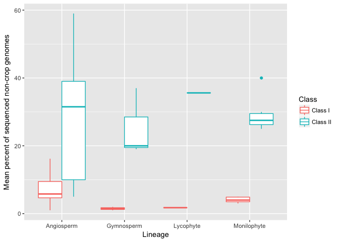

Figures for Boxes
================
Michael Song

``` r
flybase <- read.csv("flybase.csv")
plot(flybase[,3],flybase[,2], ylab = "Number of TE insertions", xlab="Year (YYYYMM)", main = "TE insertions in Flybase Annotations")
```


``` r
plants <- read.csv("TEsplantsnoBryo.csv")

head(plants)
```

    ##                         Name    common.name         Family   Division
    ## 1          Nelumbo nucifera    sacred lotus Nelumbonacease Angiosperm
    ## 2           Setaria italica  foxtail millet       Poaceae  Angiosperm
    ## 3   Brachypodium distachyon           grass       Poaceae  Angiosperm
    ## 4 Phyllostachys heterocycla          bamboo       Poaceae  Angiosperm
    ## 5        Eucalyptus grandis      eucalyptus      Myrtaceae Angiosperm
    ## 6     Thellungiella parvula    wild mustard   Brassicaceae Angiosperm
    ##   Total.TE.content Percent    Class                Reference
    ## 1             48.0   31.50 Class II        Ming et al., 2013
    ## 2             46.3   31.60 Class II       Zhang et al., 2012
    ## 3             26.0   21.40 Class II       Vogel et al., 2010
    ## 4             59.0   39.00 Class II        Peng et al., 2013
    ## 5               NA   44.50 Class II      Myberg et al., 2014
    ## 6              7.5    5.55 Class II Dassanayake et al., 2011

``` r
plot2 <- ggplot(plants, aes(x=Division, y=Percent, color = Class)) + 
  geom_boxplot() + ylab("Mean percent of sequenced non-crop genomes") + xlab("Lineage")

plot2
```

    ## Warning: Removed 3 rows containing non-finite values (stat_boxplot).


